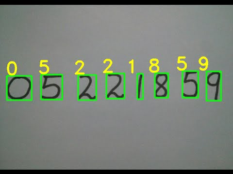
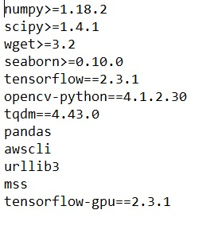
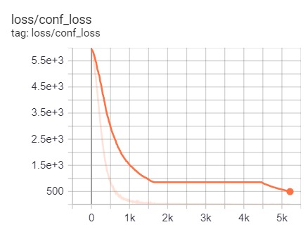
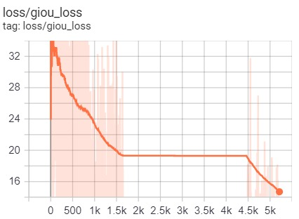
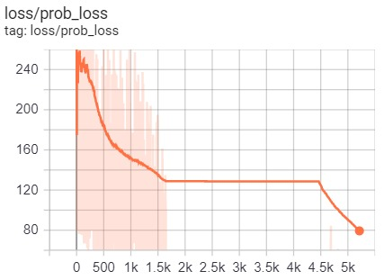
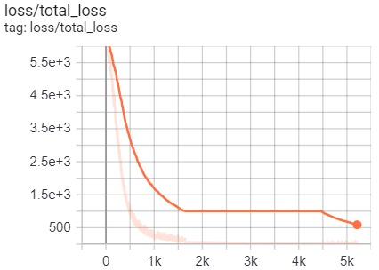
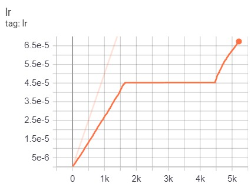

# Optidash_Project_OCR

## What is an OCR ? 
Optical character recognition or optical character reader is the electronic or mechanical conversion of images of typed, handwritten or printed text into machine-encoded text, whether from a scanned document, a photo of a document, a scene-photo or from subtitle text superimposed on an image.




To train our network to recognize these sets of characters, we utilized the MNIST digits dataset as well as the NIST Special Database 19 (for the A-Z characters).

### Installation
First, clone or download this GitHub repository. Install requirements and download pretrained weights:

```
pip install -r ./requirements.txt

# yolov3
wget -P model_data https://pjreddie.com/media/files/yolov3.weights

# yolov3-tiny
wget -P model_data https://pjreddie.com/media/files/yolov3-tiny.weights

# yolov4
wget -P model_data https://github.com/AlexeyAB/darknet/releases/download/darknet_yolo_v3_optimal/yolov4.weights

# yolov4-tiny
wget -P model_data https://github.com/AlexeyAB/darknet/releases/download/darknet_yolo_v4_pre/yolov4-tiny.weights
```
## Quick training for custom mnist dataset
mnist folder contains mnist images, create training data:
```
python mnist/make_data.py
```
`./yolov3/configs.py` file is already configured for mnist training.

The requirements.txt file will include all the needed libraries for the project.



Open the terminal and type in 
```
mnist/make_data.py
```
This will create all training data needed for the project and it converts the data.

To train the model use 
```
python train.py
```
One can train this model on GPU for faster results.


A little about the datastst used for taining:-

The mnist folder has the subfolder named mnist , which contains the zip files of mnist training dataset i.e. test and train folders, which is extracted to the mnist_test and mnist_train folders.
The noise_image folder contains the background images (i.e. pictures of the documents) for the training dataset which we have been made by us.


The yolov3.py contains the code for training the model for data where the functions darknet53() and darknet19_tiny contains the code for tranining the model.


The next is the configs.py file which conatins alll the configurations used while training the model as welll as testing it. It includes:-

1. Yolo Options
```
YOLO_TYPE                   = "yolov3" # yolov4 or yolov3
YOLO_FRAMEWORK              = "tf" # "tf" or "trt"
YOLO_V3_WEIGHTS             = "model_data/yolov3.weights"
YOLO_V4_WEIGHTS             = "model_data/yolov4.weights"
YOLO_V3_TINY_WEIGHTS        = "model_data/yolov3-tiny.weights"
YOLO_V4_TINY_WEIGHTS        = "model_data/yolov4-tiny.weights"
YOLO_TRT_QUANTIZE_MODE      = "INT8" # INT8, FP16, FP32
YOLO_CUSTOM_WEIGHTS         = False # "checkpoints/yolov3_custom

```
This specifies the yolo verison used i.e. yolov3 or yolov4, the framework used for yolo which could be tf or trt. 
YOLO_v3_weights epcifies the weights used to train the model to detect the numbers.

2. Model Train Options
```
TRAIN_SAVE_BEST_ONLY        = True # saves only best model according validation loss (True recommended)
TRAIN_SAVE_CHECKPOINT       = False # saves all best validated checkpoints in training process (may require a lot disk space) (False recommended)
TRAIN_CLASSES               = "mnist/mnist.names"
TRAIN_ANNOT_PATH            = "mnist/mnist_train.txt"
TRAIN_LOGDIR                = "log"
TRAIN_CHECKPOINTS_FOLDER    = "checkpoints"
TRAIN_MODEL_NAME            = "{}_custom".format(YOLO_TYPE)
TRAIN_LOAD_IMAGES_TO_RAM    = True # With True faster training, but need more RAM
TRAIN_BATCH_SIZE            = 1
TRAIN_INPUT_SIZE            = 864 # change this
TRAIN_DATA_AUG              = True
TRAIN_TRANSFER              = True
TRAIN_WARMUP_EPOCHS         = 2
TRAIN_EPOCHS                = 30

```

This saves the best model accodring the validation loss and checkpoints asscoiated in training process hence TRAIN_SAVE_CHECKPOINT should be set to False.
TRAIN_CLASSES contains the classes into which the model will classify the digits into 0,1,.....,9.

3. Model Test Options
This sepcifies the test options similar to train options
```
TEST_ANNOT_PATH             = "mnist/mnist_test.txt"
TEST_BATCH_SIZE             = 1
TEST_INPUT_SIZE             = 864 # change this
TEST_DATA_AUG               = False
TEST_DECTECTED_IMAGE_PATH   = ""
TEST_SCORE_THRESHOLD        = 0.3
TEST_IOU_THRESHOLD          = 0.45

```

The train.py file will train the model and optimize the model. The utils.py does image processing and draw bounding boxes around the handwritten digits.


evalute_mAP.py

Each model is judged by its performance over a dataset, usually called the “validation/test” dataset. This performance is measured using various statistics — accuracy, precision, recall etc.
The most common metric of choice used for Object Detection problems — The Mean Average Precision aka, the mAP.

Handwritten digit recongnizer models are usually trained on a fixed set of classes, so the model would locate and classify only those classes in the image.
Also, the location of the object is generally in the form of a bounding rectangle.
So, this involves both localisation of the object in the image and classifying that object.


This metric is commonly used in the domains of Information Retrieval and Object Detection. 


Now, you can train it and then evaluate your model
```
python train.py
tensorboard --logdir=log
```
Track training progress in Tensorboard and go to http://localhost:6006/:

<p>
    </a>
</p>

<p>
    </a>
</p>

<p>
    </a>
</p>

<p>
    </a>
</p>

<p>
    </a>
</p>


